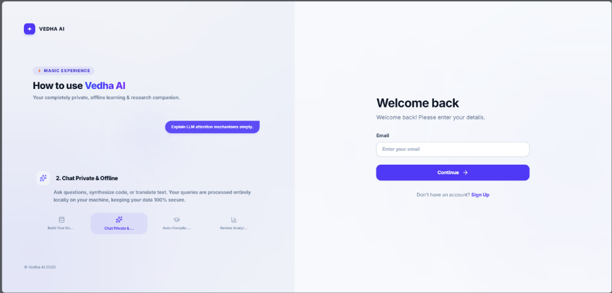
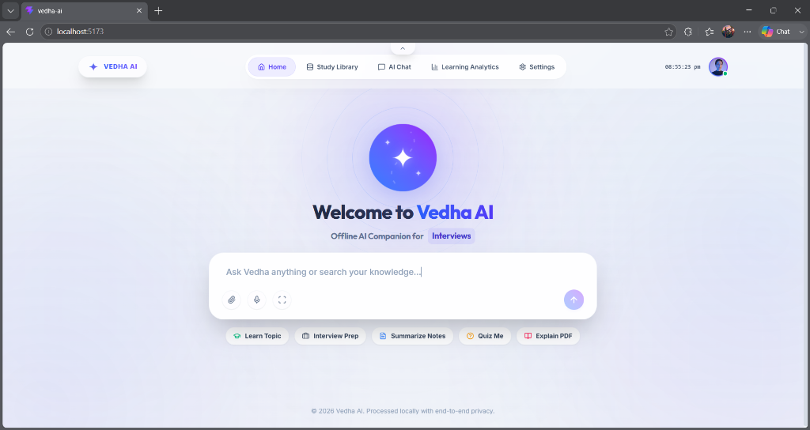
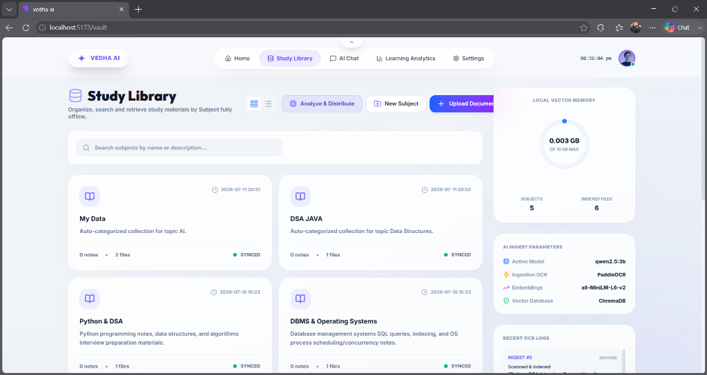
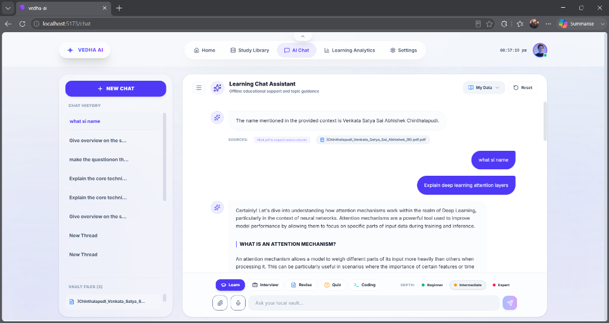
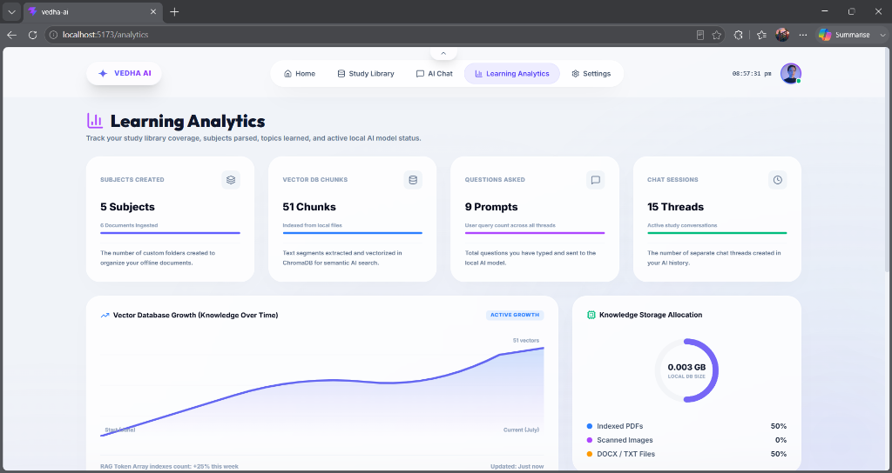
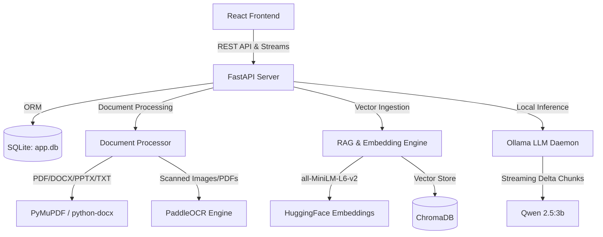

# Vedha AI — Offline AI Education & Interview Preparation Assistant

### 🎓 K-Hub Batch 2026-27 | Senior Developer Intern Task Submission

---

## 📌 Project Overview
Vedha AI is a state-of-the-art, secure, and **100% offline** AI-powered education assistant. It acts as an interactive personal AI tutor, mock interviewer, notes summarizer, and quiz creator. Students can upload study notes, lecture slides, and scanned diagrams (PDFs, DOCX, PPTX, Images) to query concepts, generate multiple-choice quizzes, receive custom explanations (Beginner, Intermediate, Expert), and simulate technical interviews.

All processing—including text extraction, image OCR, embedding generation, vector database indexing, and LLM text generation—happens **entirely locally** on the user's workstation. This guarantees absolute data privacy, zero API costs, and full functionality even without internet connectivity.

---

## 🖼️ Application Walkthrough (UI Preview)

Here is a visual walkthrough of the Vedha AI workspace:

### 🔐 1. Authentication & Onboarding
The system features a clean, responsive glassmorphic login gate to access secure offline profiles.


### 🏠 2. Dashboard Home & Quick Actions
A dynamic landing page showing the central animated voice orb indicating model states (`listening`, `processing`, `idle`) alongside quick study trigger buttons.


### 📚 3. Study Library (Subject Vault)
Organize your notes into dedicated subject collections. The dashboard shows real-time synchronization states, file sizes, and vector database memory usage.


### 💬 4. RAG Chat Assistant & Document Citations
Multi-turn conversations guided by custom explanation modes (Beginner, Intermediate, Expert) and learning styles (Mock Interview, Quiz, Revision). Every answer includes source document citations and a clickable page chunks inspector.


### 📊 5. Deep Learning Analytics & Log Feeds
A telemetry dashboard showing memory consumption charts, question counts, prompt statistics, and a live console log monitor showing offline indexing activities.


---

## 🎯 1. Domain Choice
* **Selected Domain**: Core Computer Science Education & Interview Preparation.
* **Why this Domain?**:
  1. **Intellectual Property & Privacy**: Academic research, draft documents, assignments, and proprietary syllabus materials should not be sent to public external LLM APIs.
  2. **Zero-Cost Accessibility**: Running the system offline enables students to study, revise, and prepare for placement tests without needing an active internet connection or paid API keys.
  3. **Structured Subjects**: Core computer science subjects (like Data Structures & Algorithms, DBMS, Operating Systems, and OOP) have dense technical concepts, code fragments, and memory diagrams. A RAG-based offline system is ideal for isolating study contexts into distinct subjects.

---

## 🧠 2. Chosen Approach & Technical Reasoning
For the chatbot's core architecture, we chose a **Pretrained Model with Local RAG & Strong Prompting** instead of *fine-tuning* or *building from scratch*.

| Approach | Latency / Resource Overhead | Knowledge Updateability | Persona Flexibility | Evaluation / Grounding |
| :--- | :--- | :--- | :--- | :--- |
| **From Scratch** | ❌ Extremely High (Millions of $ in GPU hours, huge datasets needed) | ❌ Static & Hard to Retrain | ❌ Poor without massive alignment | ❌ High hallucination rate |
| **Fine-Tuning** | ⚠️ Medium-High (Requires GPU clusters, hours of training per run) | ❌ Static (Cannot search new documents without retraining) | ⚠️ Locked to fine-tuned behavior | ❌ High hallucination rate on new facts |
| **Pretrained + Local RAG (Chosen)** | **✅ Low-Medium** (Runs on standard consumer CPUs, zero training time) | **✅ Real-Time** (Index new PDFs/notes in seconds; instant vector updates) | **✅ High** (Change modes on-the-fly via system prompts) | **✅ High** (Source citations map LLM output directly to text chunks) |

### Why We Selected This:
1. **Dynamic Document Updates**: Fine-tuned models cannot "read" a newly uploaded class document. Local RAG indexes new documents in seconds and immediately integrates them into the model's context.
2. **Fact Grounding (No Hallucinations)**: Injecting retrieved text snippets directly into the prompt grounds the LLM, forcing it to answer based on the textbook rather than guessing.
3. **Source Citations**: RAG allows mapping generated answers to exact document sources and page numbers, displaying clickable citations inside the chat bubbles.
4. **Zero GPU Cost**: The chosen setup allows any standard student laptop to run embeddings (`all-MiniLM-L6-v2`) and inference (`qwen2.5:3b`) on standard CPU hardware.

---

## ⚖️ 3. Technical Tradeoffs Navigated

### Tradeoff 1: LLM Parameter Size vs. Inference Latency & Instruction Adherence
* **The Challenge**: Running LLMs locally on consumer hardware (8GB–16GB RAM, CPU-only) poses strict hardware constraints.
* **The Options**:
  * *Option A (7B+ Models)*: Larger models (e.g. Llama 3.1 8B, Mistral 7B) have outstanding reasoning capabilities but suffer slow speeds (~2–3 tokens/second on standard CPUs), resulting in an unusable lag.
  * *Option B (1B–2B Models)*: Extremely tiny models (e.g. Qwen 2.5 1.5B, Gemma 2B) run fast but fail to maintain complex structured templates (e.g., they output broken JSON in Quiz Mode, break character in Interview Mode, or hallucinate citations).
* **The Solution**: We selected **Qwen 2.5 3B** as the default model. It runs at a high speed (~15+ tokens/second on modern CPUs) while maintaining a level of instruction adherence comparable to 7B models, maintaining strict persona guidelines and output formats.

### Tradeoff 2: Optical Character Recognition (OCR) Overhead vs. Standard Text Extraction
* **The Challenge**: Students frequently upload scanned PDFs, slide screenshots, or handwritten notes, which contain zero selectable text.
* **The Solution**: We implemented a hybrid extraction pipeline in [doc_processor.py](file:///e:/vs%20code/vedha%20Ai/backend/app/services/doc_processor.py):
  * First, attempt high-speed text extraction via `PyMuPDF` (taking <50ms per page).
  * If the character count is below a minimum threshold, trigger `PaddleOCR` to scan text out of document layouts. This ensures no document is left unread, while avoiding OCR overhead for digital documents.

---

## 🏗️ System Architecture Stack



* **Frontend**: React 18, Vite, TypeScript, TailwindCSS, Framer Motion (fluid interactive animations), Lucide.
* **Backend API Engine**: Python, FastAPI, Uvicorn, SQLite (relational records via SQLAlchemy ORM).
* **Embeddings**: HuggingFace Sentence Transformers (`all-MiniLM-L6-v2` running locally on CPU).
* **Vector Store**: ChromaDB (locally persisted collection nodes).
* **OCR Parser**: PaddleOCR (offline optical text engine).
* **Local LLM Engine**: Ollama running `qwen2.5:3b` (local streaming inference).

---

## 📂 Directories & Files Layout

```text
vedha-ai/
├── backend/                       # FastAPI Backend Application
│   ├── app/
│   │   ├── models/                # Database Models & Pydantic Schemas
│   │   │   ├── database_models.py # SQLAlchemy Relational Tables
│   │   │   └── schemas.py         # Pydantic DTO Validation Models
│   │   ├── routers/               # API Route Controllers
│   │   │   ├── analytics.py       # DB size, memory, and logs endpoints
│   │   │   ├── chat.py            # Stream generation, history, and modes
│   │   │   ├── collections.py     # Subject folder management
│   │   │   ├── documents.py       # File registry & Vector chunks
│   │   │   ├── settings.py        # System config & OCR triggers
│   │   │   └── voice.py           # Local TTS Kokoro API Wrapper
│   │   ├── services/              # Core Business Logic Handlers
│   │   │   ├── doc_processor.py   # PyMuPDF & PaddleOCR Extractor
│   │   │   ├── llm_service.py     # Ollama client pool & streaming
│   │   │   ├── rag_engine.py      # Chroma vector similarity search
│   │   │   └── system_service.py  # System memory & log tracker
│   │   ├── config.py              # Directory constants and RAG parameter defaults
│   │   └── database.py            # SQLite connections & startup seeding
│   ├── data/                      # Local Persisted Database Folder
│   │   ├── uploads/               # Ingested PDF & text documents
│   │   ├── chroma/                # Vector database persist files
│   │   └── app.db                 # SQLite relational database file
│   ├── main.py                    # FastAPI server entry point
│   └── requirements.txt           # Python backend dependencies
│
├── src/                           # React Frontend Application
│   ├── components/                # Shared UI widgets (AI Orb, Glass Card)
│   ├── layouts/                   # RootLayout.tsx Navigation Shell
│   ├── pages/                     # Application Dashboard Views
│   │   ├── Home.tsx               # Drag-and-drop ingestion & Quick Actions
│   │   ├── Chat.tsx               # Learn & Interview Chat Panel
│   │   ├── Vault.tsx              # Subjects organizer & Concept graph
│   │   ├── Analytics.tsx          # Real-time telemetry, rings & terminal logs
│   │   ├── Chunks.tsx             # Vector DB Chunks inspector grid
│   │   └── Settings.tsx           # Offline models config & service indicators
│   ├── services/                  # REST API & SSE client helper
│   ├── index.css                  # Custom scrollbars & theme animations
│   └── main.tsx                   # React mount root
│
├── knowledge_base/                # Seeded Course Reference Materials
│   ├── Python_DSA_Interview_Prep.txt
│   ├── DBMS_OS_Core_Concepts.txt
│   └── Java_OOP_Cheat_Sheet.txt
│
└── evaluate_system.py             # System Evaluation & Diagnostics Benchmark
```

---

## 💾 Relational SQLite Database Schema

SQLite manages relational indexes, chat history, and configs. The schema includes:

* **`collections`**: Manages isolated folder containers representing study subjects (e.g. `python-dsa`).
  * Columns: `id`, `name`, `description`, `icon_type`, `created_at`, `updated_at`.
* **`documents`**: Tracks uploaded files, sizing metrics, summary paragraphs, and relational subject bindings.
  * Columns: `id`, `name`, `size`, `type`, `status`, `upload_date`, `summary`, `ocr_text`, `tags`, `collection_id` (ForeignKey).
* **`chat_sessions`**: Tracks conversation threads.
  * Columns: `id`, `title`, `date`, `collection_id` (ForeignKey - syncs folder files when reloading chat threads).
* **`chat_messages`**: Tracks historical queries and assistant streaming text responses with citations.
  * Columns: `id`, `session_id` (ForeignKey), `role`, `content`, `timestamp`, `citations` (comma-separated cited files).
* **`system_settings`**: Persists system configurations (e.g. chunk size, active model tag).
  * Columns: `key`, `value`.

---

## ⚡ Default Subject Seeding on Startup
On the initial launch, the system automatically checks the SQLite database and seeds three default Subjects with actual study notes. These are instantly vectorized in ChromaDB:
1. **Python & DSA** (`python-dsa`): Seeded with `Python_DSA_Interview_Prep.txt` covering decorators, Big-O complexity, and lists.
2. **DBMS & Operating Systems** (`dbms-os`): Seeded with `DBMS_OS_Core_Concepts.txt` covering normalization (1NF, 2NF, 3NF) and CPU scheduling algorithms.
3. **Java & OOP Core** (`java-oop`): Seeded with `Java_OOP_Cheat_Sheet.txt` explaining the pillars of OOP (encapsulation, inheritance, polymorphism, and abstraction).

---

## 📚 Educational Modes & Custom Prompting

Vedha AI features customized prompt generation based on selected modes and explanation depths:

### 1. Chat Modes
* **Learn Mode**: Guides the student step-by-step through topics, providing clear definitions, analogies, and practice questions.
* **Interview Mode**: Acts as a professional technical interviewer. Evaluates the user's answers, provides constructive feedback, details common follow-up questions, and asks the next question.
* **Revision Mode**: Generates structured summaries, key terms to remember, common exam tips, and quick revision sheets.
* **Quiz Mode**: Formulates multiple-choice questions (MCQs) or short questions based on the retrieved document context, hiding the answer key at the bottom.
* **Coding Mode**: Tutors coding and algorithms, providing well-commented code blocks and memory complexity analysis.

### 2. Explanation Depths
* **Beginner 🟢**: Keeps explanations simple, uses basic analogies, avoids deep jargon, and explains concepts from scratch.
* **Intermediate 🟡**: Provides balanced explanations with moderate details and practical examples.
* **Expert 🔴**: Dives deep into technical implementation details, memory layouts, and performance complexities.

---

## 🖥️ Page-by-Page Feature Tour

### 1. Home Dashboard (`/`)
* **AI Orb**: A fluidly animated central voice orb indicating the system's state (`listening`, `processing`, `idle`).
* **Drag-and-Drop Ingestion**: Upload a study file directly. The pipeline will pre-analyze the file, auto-detect its category, and index it.
* **Educational Quick Modes**: Click buttons like `📚 Learn Topic`, `💼 Interview Prep`, `📝 Summarize Notes`, `❓ Quiz Me`, or `📖 Explain PDF` to start focused learning activities directly.

### 2. Study Library (`/vault`)
* **Visual Concept Graph**: An interactive network graph rendering connected entities, definitions, and terms extracted from your study documents.
* **Subjects Organizer**: Create, view, and delete isolated academic subjects. Tracks file counts and overall indexing completion progress.
* **Document Management**: Browse files inside subjects, review AI-generated document summaries, and delete documents (clearing their indices from ChromaDB).

### 3. AI Chat (`/chat`)
* **Chronological History**: Organize discussions in threads sorted by time.
* **Contextual Subject Syncing**: Selecting any old session in the sidebar automatically reloads the correct document folder and files pane associated with that chat.
* **Pill Selectors**: Switch modes and explanation depths directly above the input box.
* **Live Citation Chunks Explorer**: Click any cited source file pill in a message bubble to open the inspector drawer. It queries ChromaDB to display the actual page-by-page text chunks retrieved for that document.
* **Floating "Highlight-to-Chat" Bubble**: Highlight any sentence in the chat feed or citation inspector. A floating button (**"✨ Ask Vedha"**) appears. Clicking it instantly copies the selection into your prompt input for follow-up questions.

### 4. Learning Analytics (`/analytics`)
* **System Telemetry**: Displays local disk space usage, active RAM/hardware load, active model configurations, and total vectorized database chunks.
* **Learning Metrics**: Track total subjects created, study hours logged, topic counts, mock questions generated, and quiz scores.
* **Chunk DB Inspector**: Direct shortcut to the **Vector DB Chunks Registry** to browse, filter, and search raw text fragments indexed inside ChromaDB.

### 5. Settings Configuration (`/settings`)
* **Model Selector**: Switch between installed Ollama models.
* **Chunking Controls**: Configure chunk sizes and overlap parameters for new vector extractions.
* **OCR Toggle**: Enable or disable OCR scanning and set OCR language packs.

---

## 🖥️ System Evaluation & Diagnostics (`evaluate_system.py`)

Vedha AI comes with a built-in evaluation script to verify local model performance, measure latency, and check vector indexes. 

Run the diagnostics using the following command inside your backend virtual environment:
```bash
python evaluate_system.py
```

### What it checks:
1. **Dependencies**: Verifies key local ML libraries (`chromadb`, `sentence_transformers`, `langchain`) are correctly imported.
2. **Embedding Performance**: Vectorizes a test phrase using local HuggingFace embeddings (`all-MiniLM-L6-v2`) and measures the latency in milliseconds.
3. **Ollama Connection**: Queries Ollama's local daemon status, lists all pulled models, and checks if `qwen2.5:3b` is available.
4. **LLM Inference Speed**: Streams an educational query to the local LLM and measures the **Time-to-First-Token (TTFT)**, total generation time, and **generation speed** in words per second.
5. **ChromaDB Collections**: Inspects the Chroma database, listing all collections and chunk counts.

---

## 🛠️ Step-by-Step Installation Guide

### Prerequisites
* **Node.js**: v18.0.0 or higher
* **Python**: v3.10.x or v3.11.x (PaddleOCR requires specific C++ build libraries on Windows)
* **Ollama**: Installed and running locally (get it from [ollama.com](https://ollama.com))

---

### Step 1: Install Local Ollama Runner
1. Download the installer for your OS (Windows/Mac/Linux) from [Ollama's Download Page](https://ollama.com/download).
2. Launch the Ollama desktop app to start the local background service (`http://localhost:11434`).
3. In your terminal, pull the default lightweight and high-performance LLM model:
   ```bash
   ollama pull qwen2.5:3b
   ```

---

### Step 2: Set Up Python Backend Engine
1. Navigate to the `backend` folder:
   ```bash
   cd backend
   ```
2. Create and activate a secure virtual environment:
   * **Windows (PowerShell)**:
     ```powershell
     python -m venv venv
     .\venv\Scripts\Activate.ps1
     ```
   * **macOS/Linux**:
     ```bash
     python -m venv venv
     source venv/bin/activate
     ```
3. Install backend packages:
   ```bash
   pip install --upgrade pip
   pip install -r requirements.txt
   ```
4. Start the FastAPI backend server:
   ```bash
   python main.py
   ```
   *The backend runs at `http://127.0.0.1:8000`. API docs are interactive at `http://127.0.0.1:8000/docs`.*

---

### Step 3: Run the React Frontend Application
1. Navigate to the project root directory in a new terminal:
   ```bash
   cd "e:/vs code/vedha Ai"
   ```
2. Install node dependencies and start the development server:
   ```bash
   npm install
   npm run dev
   ```
3. Open your browser and navigate to `http://localhost:5173`.
4. Enter secure credentials (bypass page) to explore the system!

---

## ✅ Deliverables Checklist
- [x] **Chosen Domain**: Core Computer Science Education & Interview Preparation.
- [x] **Approach Rationale**: Documented Pretrained Model + Local RAG reasoning.
- [x] **Source Code**: Source files for both FastAPI backend and React frontend.
- [x] **Knowledge Base Files**: Seeded files packaged in [knowledge_base/](file:///e:/vs%20code/vedha%20Ai/knowledge_base).
- [x] **Evaluation Script**: Live system test benchmark in [evaluate_system.py](file:///e:/vs%20code/vedha%20Ai/evaluate_system.py).
- [x] **Tradeoff Navigated**: Documented local model parameter vs inference latency tradeoffs.
- [x] **Project Status**: Fully completed, verified, and running 100% offline.
