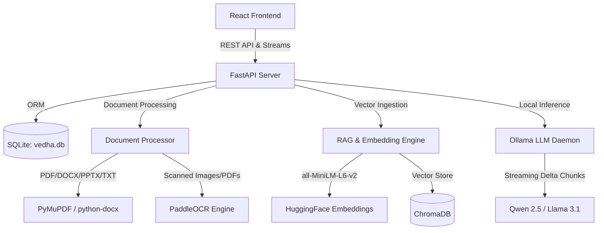

# Vedha AI - Offline Education & Interview Prep Backend

Vedha AI is a secure, fully offline AI education assistant backend. It is powered by FastAPI, SQLite, ChromaDB, and local LLM/embedding inference systems to guarantee data privacy and offline study capabilities.

---

## 🏗️ Backend System Architecture



The backend is composed of the following key layers:

### 1. Web Entry Point (`main.py`)
- **FastAPI Web Framework**: Exposes low-latency HTTP API endpoints and supports server-sent event (SSE) streams for streaming responses.
- **Service Hooks**: Performs health checks during application startup, initial SQLite index migration, and auto-detects active local LLMs running inside the Ollama runner.

### 2. Relational Database & Metadata Store (`app/database.py`)
- **SQLite**: Stores non-vector structured records locally in `data/vedha.db`.
- **Relational Tables**:
  - `collections`: Folder structures representing academic subjects.
  - `documents`: Document-level metadata, size metrics, auto-generated summaries, and keywords.
  - `chat_sessions` & `messages`: Stores local chat logs and prompt history.
  - `settings`: Ingestion configuration (chunk size, overlap, active model tags).

### 3. Document Processing Pipeline (`app/services/doc_processor.py`)
- **Multi-Format Ingestion**:
  - **PDFs**: Scans pages using `PyMuPDF` (fitz). If no selectable text is found, it automatically flags the page as scanned.
  - **PowerPoints & Word Docs**: Extracted using `python-pptx` and `python-docx` respectively.
  - **Images & Scans**: Processes raw files (PNG, JPG, JPEG) or scanned PDF page pixmaps.
- **PaddleOCR Engine**: Integrates an offline optical character recognition parser to scan text out of diagrams, notes, and receipts.
- **Auto-Tagging**: Runs text heuristic keywords analysis to categorize documents (e.g., *Transformer*, *Finance*, *Security*, *System Architecture*).

### 4. Vector Embedding & Retrieval Engine (`app/services/rag_engine.py`)
- **Text Splitting**: Splits document text into manageable snippets using `RecursiveCharacterTextSplitter` configured dynamically by user chunk sizes.
- **SentenceTransformer Embeddings**: Vectorizes text chunks locally using the `all-MiniLM-L6-v2` HuggingFace embedding model (running entirely offline on CPU/GPU).
- **Persistent ChromaDB**: Registers chunks into a local Chroma database at `data/chroma/`.
- **Similarity Search**: Performs high-speed semantic matching between user queries and documents, returning matching context snippets with relevance scores.

### 5. Local LLM Service (`app/services/llm_service.py`)
- **Ollama Integration**: Communicates via REST with the local Ollama desktop daemon (`http://localhost:11434`).
- **Streaming Generation**: Fetches streaming delta tokens from local language models (e.g., `qwen2.5:3b`, `llama-3.1-8b`, `phi-3-mini`), allowing users to read chat responses in real-time.

---

## ⚡ Startup Sequence & Log Verification

When you execute `python main.py` inside the virtual environment (`venv`), the server initiates the following checks:

```
[INFO] DocProcessor: PaddleOCR library imported successfully.
INFO:     Started server process [12764]
INFO:     Waiting for application startup.
[INFO] Main: Vedha AI offline RAG backend server starting up...
[INFO] Main: SQLite relational indices initialized successfully.
[INFO] Main: Ollama runner verified active at: http://localhost:11434
[INFO] Main: Available local models: ['qwen2.5:3b', 'gemma:2b', 'llama3local:latest', 'llama3:latest', 'gemma4:latest']
INFO:     Application startup complete.
```

1. **OCR Verification**: Imports `PaddleOCR` (falls back to basic metadata scanning if not present).
2. **Metadata Setup**: Runs `init_db()` to check if `vedha.db` exists; automatically creates required tables if missing.
3. **Ollama Check**: Contacts Ollama status endpoint at `/api/tags` to ensure the local daemon is active.
4. **Model Ingestion**: Fetches installed model tags so the user can switch between their downloaded LLMs.

---

## 📂 Directories & Files Layout

All databases and processed data are placed inside the unified `data` folder:
- `backend/data/vedha.db`: SQLite database.
- `backend/data/uploads/`: Original uploaded document assets.
- `backend/data/chroma/`: Chroma DB collections.
